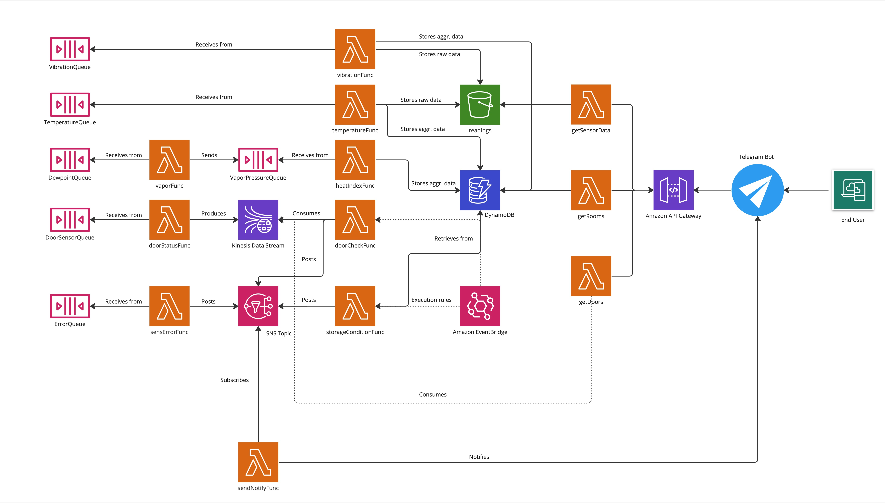

# Wine Cellar

Simple IoT Architecture designed for the Serverless Computing for IoT Course at the University of Salerno.
It makes use of Docker, Localstack and various utilities in order to manage, in a very simplified and straightforward way, a wine cellar.

- [Wine Cellar](#wine-cellar)
  - [Introduction](#introduction)
  - [Proposed Project Architecture](#proposed-project-architecture)
    - [Services Used](#services-used)
  - [Installation](#installation)
    - [Requirements](#requirements)
    - [Setting up the environment](#setting-up-the-environment)
    - [Automated Install](#automated-install)
    - [Manual Install](#manual-install)
    - [Playing around with the app](#playing-around-with-the-app)
  - [Future developments](#future-developments)

## Introduction

It is a known fact that fine wines require a certain degree of aging. For decades, humanity has developed many ways of keeping wine in the perfect conditions to do so.
In the IoT era, with people being able to fully computerize their hown homes, sensor could also be used in a local environment to construct and operate a small wine cellar.
This project aims at giving a simplified perspective of what a simple IoT architecture could be, by making use of sensors and AWS services emulated through localstack.

## Proposed Project Architecture



The architecture makes use of Lambda functions in order to recover sensor data from Amazon SQS Queues.
The data gets saved to an S3 bucket, for archiving purposes and in the form of a "data lake" for future inspection.
The aggregated data between each read is obtained by averaging values and comparing them with the current status. This aggregated data gets saved to the DynamoDB table, in order to provide a full view of the system through a Telegram bot that interfaces with the DB.

Obviously, the DB differentiates the status of each room, by providing estimations of temperature, relative humidity and vibration. Each room is assigned to a certain type of wine, whose characteristics and storage conditions change and must be preserved.

Keeping the door open in one of the rooms could be a source of trouble: that's why the room is constantly monitored through the use of a Kinesis Data Stream, which is periodically checked in order to see if the door has remained open too long.

Whenever there's an error situation, be it a malfunctioning sensor, or the storage conditions aren't met, or the door is still open after 10 minutes, a message is sent to an SNS topic.

Here, the message is then processed by a lambda function, that sends an HTTP request to the Telegram bot, which notifies the subscribed user.

The user can simply manage and keep track of all the data through the use of a Telegram Bot.
He can see the status of all the rooms, or each room individually, check the door status in real time thanks to Kinesis and an API Gateway.
He can also access to charts, that summarize the history of the measurements thanks to the S3 Bucket.

### Services Used

Here's a brief list of AWS services used:

- Amazon SQS
- Amazon Lambda
- Amazon Kinesis Data Stream
- Amazon DynamoDB
- Amazon S3
- Amazon SNS
- Amazon EventBridge
- Amazon CloudWatch Logs
- Amazon API Gateway

The project also makes use of a Telegram Bot, and there's a very rough but simple web application with a comprehensive dashboard, powered by Sinatra, a very simple DSL for web app creation.

## Installation

### Requirements

- Docker
- Docker Compose
- Localstack
- AWS CLI
- Python 3.9 or over
- boto3
- Telegram Bot
- JQ
- Ruby
- Sinatra

### Setting up the environment

First, clone the repo and start Localstack through the docker-compose.yml.

```shell
git clone https://github.com/blazQ/wine-cellar.git
cd wine-cellar
docker-compose up
```

Then you need to either update config.py with your own Telegram ID and Bot Token, or create a .env file with your own BOT_ID and BOT_TOKEN variables.
Then simply

```shell
source .env
```

This is required, since the automated install makes use of the BOT_ID and BOT_TOKEN to power up the notification lambda function.

### Automated Install

Open another terminal in the main folder and start the setup.sh script:

```shell
chmod +x ./setup,sh
chmod +x ./zip_lambda.sh
./setup.sh
```

The shell script gets the current AWS region and gets all of the ARNs from the output of the commands, so there's no need to set anything. It should work regardless of your configuration.
For example, there's a lambda function that needs the SNS Topic Arn to be present as an environmental variable. This value is provided to the lambda by the script itself, so there's no need for you to configure it.

Once the setup does its job, it will have appended the API_ID value to the .env.
You can then start the web app with:

```shell
ruby ./src/webapp/app.rb
```

The web app is accessible at localhost:8080.
Then you can start the telegram bot, if you want to have a chat with the bot instead of simply viewing the web app.

```shell
python3 ./src/bot.py
```

The notifications will work regardless of you starting the bot script.

### Manual Install

Will be written when the project is finished.

### Playing around with the app

You can use the sensor.py and the sensorTestSuite.py to create massive tests for all of the components of the architecture and you can configure the waiting times, queue names and table names from the config.py script and the .env.
In order to use sensorTestSuite, you can start by invoking a very simple door sensor or temperature sensor:

```shell
python3 ./src/sensorTestSuite.py -st Door -r Sweets
python3 ./src/sensorTestSuite.py -st Temperature -r Sparklings
```

Or maybe massively sending random door data to all of the rooms (will fill you up with notifications):

```shell
python3 ./src/sensorTestSuite.py -all
```

## Future developments

The project could be improved by adding another data pipeline regarding the light sensors, since it's also a very important metric in the context of wine storage.
It could also be improved by developing a fully integrated web application, using Flask or some other backend server like Nginx.
It could be expanded and more functionality could be offered to the user.
